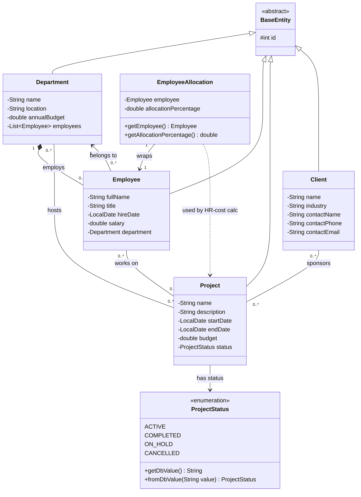
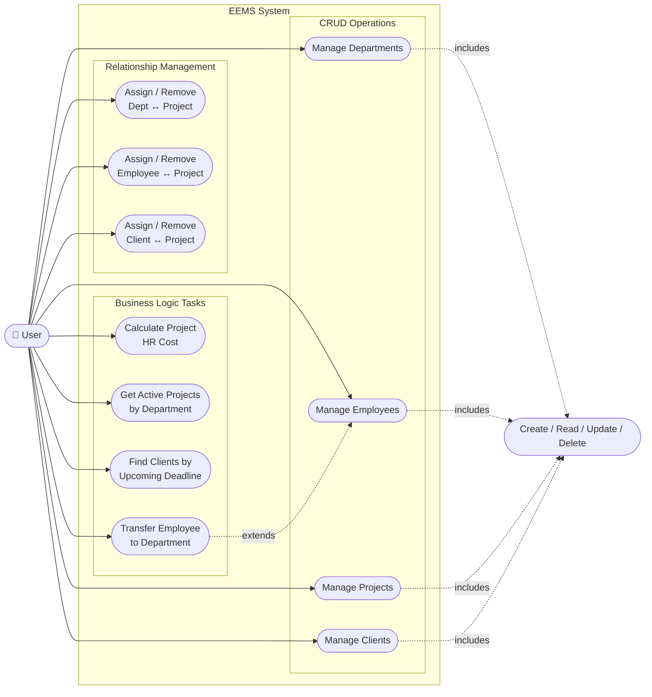
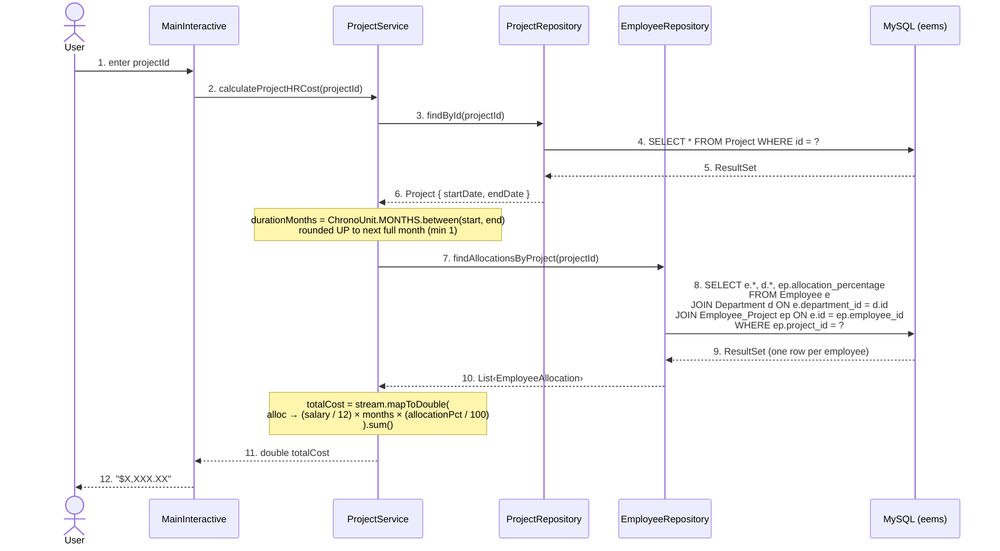
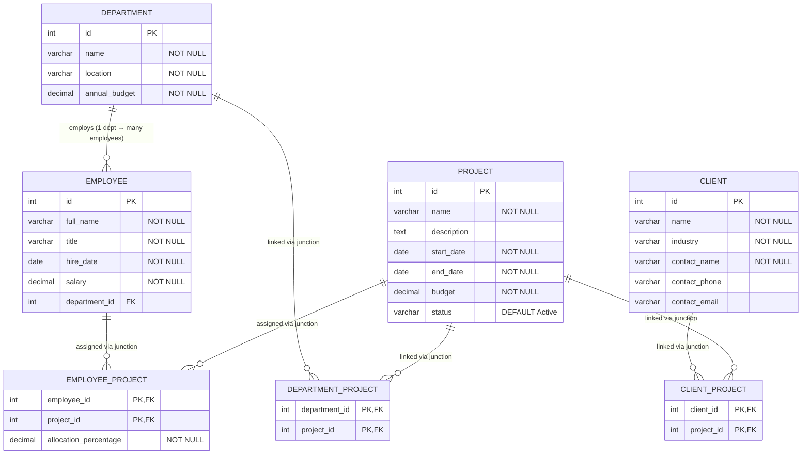

# EEMS — UML & Database Diagrams

---

## 1. Class Diagram

---

## 2. Use Case Diagram

---

## 3. Sequence Diagram — Task 1: `calculateProjectHRCost(projectId)`

---

## 4. Database / ER Diagram

